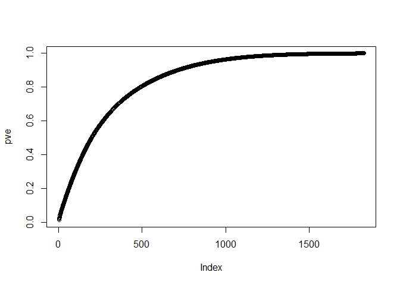
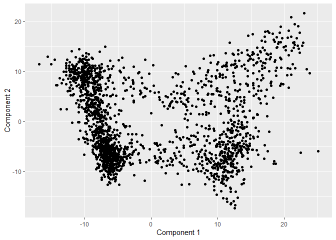
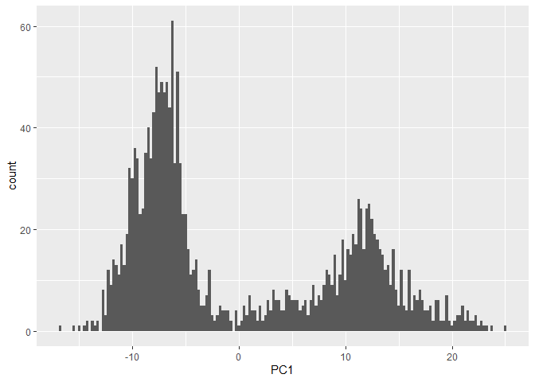
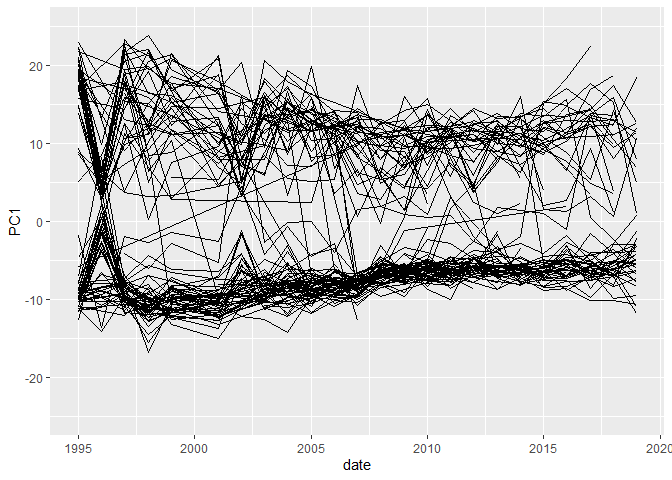
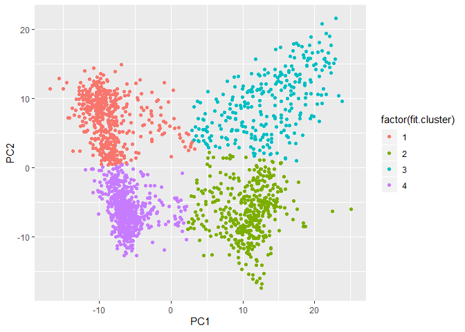
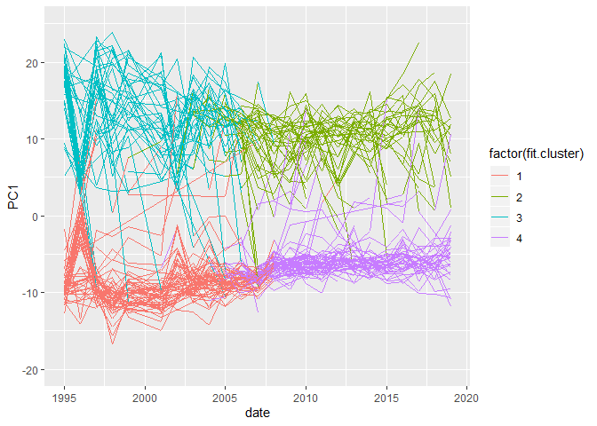

Congress PCA
================

``` r
library(ggplot2)
```

``` r
politicians = read.csv("politicians_trigram.csv", header = TRUE, row.names = 1)
trigrams = read.csv("politician_trigrams_count.csv", header = TRUE, row.names = 1)
```

``` r
trigrams = trigrams + .001

N = nrow(trigrams)
D = ncol(trigrams)

# TF weights
TF_mat = trigrams/rowSums(trigrams)
# IDF weights
IDF_vec = log(1 + N/colSums(trigrams > 0))
# TF-IDF weights:
# use sweep to multiply the columns (margin = 2) by the IDF weights
TFIDF_mat = sweep(TF_mat, MARGIN=2, STATS=IDF_vec, FUN="*")
```

``` r
# PCA on the TF-IDF weights
pca = prcomp(TFIDF_mat, scale=TRUE)
pve = summary(pca)$importance[3,]
plot(pve)  # not much of an elbow
```

<!-- -->

``` r
loadings = pca$rotation
scores = pca$x
```

We’ll look at just PC1 versus PC2 as an example of trends in our
dataset.

``` r
qplot(scores[,1], scores[,2], xlab='Component 1', ylab='Component 2')
```

<!-- -->

``` r
PCA = data.frame(scores)
```

``` r
ggplot(PCA, aes(x = PC1)) + geom_histogram(binwidth = .25)
```

<!-- -->

``` r
pol_PCA = cbind(politicians, PCA)
```

``` r
head(names(pol_PCA))
```

    ## [1] "date"        "congressman" "PC1"         "PC2"         "PC3"        
    ## [6] "PC4"

``` r
ggplot(data = pol_PCA, aes(x = date, y = PC1, group = congressman)) + 
  geom_line() +
  ylim(-25, 25)
```

    ## Warning: Removed 1 rows containing missing values (geom_path).

<!-- -->

``` r
fit = kmeans(scale(cbind(PCA$PC1, PCA$PC2)), 4)

cluster = data.frame(politicians, fit$cluster, PCA)
#names(cluster) = c("year", "politician", "cluster", "PCA1", "PCA2")
```

``` r
head(names(cluster))
```

    ## [1] "date"        "congressman" "fit.cluster" "PC1"         "PC2"        
    ## [6] "PC3"

``` r
ggplot(data = cluster, aes(x = PC1, y = PC2, color = factor(fit.cluster))) + geom_point()
```

<!-- -->

``` r
ggplot(data = cluster, aes(x = date, y = PC1, group = congressman, color = factor(fit.cluster))) +
#  scale_color_manual(values = c("blue", "red")) +
  geom_line() +
  ylim(-20, 25)
```

    ## Warning: Removed 1 rows containing missing values (geom_path).

<!-- -->

``` r
o1 = order(loadings[,1], decreasing=TRUE)
colnames(trigrams)[head(o1,100)]
```

    ##   [1] "congressional.record.house"       "speaker.pro.tempore"             
    ##   [3] "revise.extend.remarks"            "balance.time.mr"                 
    ##   [5] "back.balance.time"                "yield.back.balance"              
    ##   [7] "reserve.balance.time"             "time.may.consume"                
    ##   [9] "yield.time.may"                   "pro.tempore.mr"                  
    ##  [11] "mr.speaker.yield"                 "asked.given.permission"          
    ##  [13] "mr.speaker.rise"                  "time.mr.speaker"                 
    ##  [15] "may.consume.mr"                   "extend.remarks.mr"               
    ##  [17] "gentleman.california.mr"          "objection.request.gentleman"     
    ##  [19] "new.york.mr"                      "tempore.objection.request"       
    ##  [21] "congressional.record.extensions"  "gentleman.texas.mr"              
    ##  [23] "speaker.reserve.balance"          "yield.2.minutes"                 
    ##  [25] "yield.3.minutes"                  "u.e.congressional"               
    ##  [27] "h.u.e"                            "speaker.yield.time"              
    ##  [29] "mr.speaker.thank"                 "result.vote.announced"           
    ##  [31] "vote.announced.recorded"          "vote.taken.electronic"           
    ##  [33] "mr.speaker.reserve"               "pro.tempore.objection"           
    ##  [35] "speaker.rise.today"               "ith.h.u"                         
    ##  [37] "speaker.yield.back"               "permission.revise.extend"        
    ##  [39] "given.permission.revise"          "johnson.e.b"                     
    ##  [41] "remarks.mr.speaker"               "minutes.chair.recognizes"        
    ##  [43] "w.ith.h"                          "mr.speaker.ask"                  
    ##  [45] "mr.speaker.would"                 "fmt.7634.sfmt"                   
    ##  [47] "X7634.sfmt.0634"                  "consume.mr.speaker"              
    ##  [49] "X3.minutes.gentleman"             "amendment.offered.gentleman"     
    ##  [51] "record.extensions.remarks"        "gentleman.new.york"              
    ##  [53] "thank.gentleman.yielding"         "fmt.0626.sfmt"                   
    ##  [55] "X2.minutes.gentleman"             "speaker.thank.gentleman"         
    ##  [57] "yield.1.minute"                   "speaker.ask.unanimous"           
    ##  [59] "florida.mr.speaker"               "chair.recognizes.gentleman"      
    ##  [61] "consideration.bill.hr"            "X0626.sfmt.9920"                 
    ##  [63] "pro.tempore.speaker"              "texas.mr.speaker"                
    ##  [65] "time.mr.chairman"                 "announcement.speaker.pro"        
    ##  [67] "tempore.speaker.pro"              "levin.lewis.ga"                  
    ##  [69] "house.representatives.tuesday"    "mr.speaker.want"                 
    ##  [71] "gentlewoman.california.ms"        "house.representatives.wednesday" 
    ##  [73] "X1.minute.gentleman"              "speaker.yield.2"                 
    ##  [75] "mr.chairman.rise"                 "mr.chairman.yield"               
    ##  [77] "X4634.sfmt.0634"                  "gentleman.florida.mr"            
    ##  [79] "gentleman.illinois.mr"            "fmt.4634.sfmt"                   
    ##  [81] "california.house.representatives" "speaker.yield.3"                 
    ##  [83] "amendment.mr.chairman"            "gentleman.michigan.mr"           
    ##  [85] "mr.speaker.today"                 "house.representatives.thursday"  
    ##  [87] "gentleman.ohio.mr"                "gentleman.yield.mr"              
    ##  [89] "mr.chairman.thank"                "gentleman.new.jersey"            
    ##  [91] "committee.energy.commerce"        "california.mr.speaker"           
    ##  [93] "clerk.designate.amendment"        "designate.amendment.text"        
    ##  [95] "chairman.yield.time"              "gentleman.pennsylvania.mr"       
    ##  [97] "gentleman.massachusetts.mr"       "pro.tempore.gentleman"           
    ##  [99] "motion.reconsider.laid"           "smith.new.jersey"
